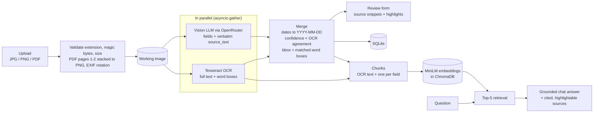
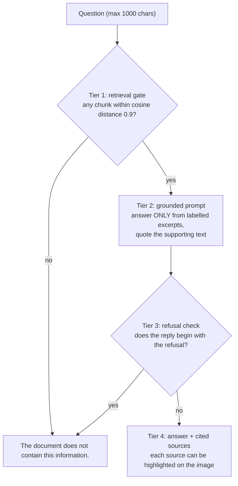

# AI Driving Licence Reader

Upload a driving licence (JPG, PNG or PDF) and get its details as an editable form, shown next to the document. Every field shows the text it came from on the card, fields that could not be confirmed are flagged for review, and clicking a field highlights where it is printed. An **Ask the Document** chat answers questions from the licence only, cites its sources and refuses to guess.

- The form has nine fields: **Full Name, Driving Licence Number, Date of Birth, Date of Issue, Date of Expiry, Address, Vehicle/Class of Licence, Issuing Authority** and **Other relevant information**. The last one holds everything else found on the card, one `Label: value` line per item (e.g. `Blood group: O+`, `LMV · Valid till: 2034-06-15`); lines can be edited, added or removed. Behind the form, each of those items keeps its own source text, confidence and highlight (`other_fields` in the API).
- A **vision LLM** reads the licence. **Tesseract OCR** runs in parallel on the same image and cross-checks every value, which drives the confidence flags and supplies the highlight boxes.
- Edits are validated and saved; reopening a document from the list shows the saved values without re-running extraction.
- The chat is retrieval-augmented (MiniLM embeddings in ChromaDB) and replies exactly *"The document does not contain this information."* when the answer is not on the card.

---

## Technology stack

| Layer | Choice |
|---|---|
| Backend | Python 3.11+, FastAPI, uvicorn, pydantic v2 |
| OCR | Tesseract via `pytesseract` (`image_to_data` for word boxes), with table rulings erased first (NumPy); `pdf2image` + poppler for PDF pages 1–2 (front and back) |
| LLM | OpenRouter (OpenAI-compatible API) through the `openai` Python SDK; model set by `LLM_MODEL` (default `google/gemini-3.8-flash`) |
| Embeddings / vector store | `sentence-transformers` `all-MiniLM-L6-v2` + ChromaDB (in-process, persisted to `./chroma`) |
| Storage | SQLite + uploaded files on disk under `./data/uploads` (server-generated UUID names) |
| Frontend | React 18 + Vite, plain `fetch`, Tailwind CSS |
| Tests | pytest + FastAPI `TestClient` (no real LLM or network calls) |
| Container | One multi-stage Dockerfile: Node build stage → `python:3.11-slim` with `tesseract-ocr` and `poppler-utils` |

---

## Architecture



The chat is grounded in four tiers. Each one can end the request with the exact refusal string:



**Request flow.** `POST /api/documents/{id}/extract` runs Tesseract in a thread executor at the same time as the vision-model call, then merges the two results, stores them and returns them. Indexing for the chat runs as a background task after the response is sent, and runs again after edits are saved so the chat sees corrected values.

| Endpoint | Purpose |
|---|---|
| `GET /api/documents` | List uploads: `doc_id`, `filename_label`, `uploaded_at`, `has_extraction` |
| `POST /api/documents` | Upload (validated) → `201 {doc_id}`; invalid → `400 {"error": ...}` |
| `GET /api/documents/{id}/image` · `/meta` | Working image · its natural `{width, height}` |
| `POST /api/documents/{id}/extract` | Run OCR ∥ VLM, merge, persist → `ExtractionResult` |
| `GET /api/documents/{id}/extract` | The saved result (404 if never extracted), so reopening never re-runs extraction |
| `PUT /api/documents/{id}/data` | Save user-edited `LicenceData` (validated) |
| `POST /api/documents/{id}/chat` | `{question}` → `{answer, sources: [{text, origin, bbox}]}` |

Every error is returned as JSON `{"error": "..."}` with a readable message; stack traces are never sent to the client.

---

## Setup and running

### 1. System dependencies (Tesseract + poppler)

**macOS**

```bash
brew install tesseract poppler
```

**Ubuntu / Debian**

```bash
sudo apt install tesseract-ocr poppler-utils
```

**Windows**: pick one of these:

- The **UB Mannheim** Tesseract installer (<https://github.com/UB-Mannheim/tesseract/wiki>) plus a **poppler-windows** release zip (<https://github.com/oschwartz10612/poppler-windows/releases>). The same packages are available through winget: `winget install UB-Mannheim.TesseractOCR` and `winget install oschwartz10612.Poppler`.
- Or with conda: `conda install -c conda-forge tesseract poppler`

These installers usually do **not** add the tools to `PATH`. In that case, set these in `.env`:

```ini
TESSERACT_CMD=C:\Program Files\Tesseract-OCR\tesseract.exe
POPPLER_PATH=C:\path\to\poppler\Library\bin
```

Both variables are optional on every OS; empty means "find it on `PATH`". If a configured path does not exist, the app logs a warning and falls back to `PATH`. That is why the same `.env` also works inside Docker.

You also need **Python 3.11+** and **Node.js 20.19+** (required by Vite 8).

### 2. Configure `.env` (OpenRouter key)

Copy the template to the **repository root** and add your key from <https://openrouter.ai/keys>:

```bash
cp backend/.env.example .env        # Windows: copy backend\.env.example .env
```

```ini
OPENROUTER_API_KEY=sk-or-...          # required (unless both models run on Ollama); the server refuses to start without it
LLM_MODEL=google/gemini-3.8-flash     # extraction model (and chat, unless LLM_CHAT_MODEL is set)
LLM_MODEL_ALT=anthropic/claude-sonnet-5   # used only by scripts/compare_models.py
LLM_CHAT_MODEL=                       # optional separate chat model
MAX_UPLOAD_MB=10
TESSERACT_CMD=
POPPLER_PATH=
```

The backend reads the root `.env` (or `backend/.env`); Docker reads the same file with `--env-file .env`. `.env` is git-ignored and the key stays on the server: it is never sent to the browser and never logged.

### 3. Backend

```bash
cd backend
python -m venv .venv
source .venv/bin/activate            # Windows: .venv\Scripts\activate
pip install -r requirements.txt      # Linux tip: first `pip install torch --index-url https://download.pytorch.org/whl/cpu` to skip CUDA
uvicorn app.main:app --reload --port 8000
```

On first start, the embedding model (~90 MB) downloads once, in the background.

### 4. Frontend

```bash
cd frontend
npm install
npm run dev                          # http://localhost:5173 (proxies /api to :8000)
```

Once dependencies are installed, day-to-day running is two commands: `uvicorn app.main:app` and `npm run dev`. The frontend always calls the relative path `/api`, so the same build works under Vite and inside the container.

### 5. Tests (pytest)

```bash
cd backend
pytest                  # whole suite, ~17 s
pytest -m phase1        # Phase 1 (steps 1-5)
pytest -m step6         # a single build step (step1 ... step10)
```

The suite makes no real LLM or network calls:
- **Extraction** uses a `FakeProvider` injected through the provider factory.
- **Embeddings** come from a deterministic fake.
- **ChromaDB** runs in memory.
- **OCR tests** use the real Tesseract binary and are skipped if it isn't installed.

Every module is marked with its build phase and step, so each can be checked on its own.

### 6. Docker

```bash
docker build -t licence-reader . && docker run -p 7860:7860 --env-file .env licence-reader
```

Open <http://localhost:7860>. FastAPI serves both the API and the built frontend.

### Fully local option: Ollama (no personal data leaves the machine)

To keep licence images and chat excerpts on your own machine, run the model locally with [Ollama](https://ollama.com):

```bash
ollama pull qwen2.5vl:3b         # any Ollama model with vision support
# or run Ollama itself in Docker (GPU optional):
docker run -d --gpus=all -v ollama:/root/.ollama -p 11434:11434 --name ollama ollama/ollama
docker exec ollama ollama pull qwen2.5vl:3b
```

```ini
LLM_MODEL=ollama/qwen2.5vl:3b    # extraction runs locally
LLM_CHAT_MODEL=                  # empty = chat uses the same local model
```

`qwen2.5vl:3b` (3.2 GB) fits a 6 GB GPU. The default `qwen2.5vl` tag (7B) reads better, but needs more memory.

- **Same pipeline.** The `OllamaProvider` uses the same prompt, the same JSON parsing and the same one-retry rule as the OpenRouter provider.
- **Chat stays local too.** Chat goes to Ollama whenever the chat model is an `ollama/...` model.
- **No key needed.** When both models are local, `OPENROUTER_API_KEY` is not required.
- **Where the server is.** The app uses Ollama's own `OLLAMA_HOST` setting (default `http://127.0.0.1:11434`, the local Ollama server). From inside Docker, point it at the host: `OLLAMA_HOST=http://host.docker.internal:11434`.
- **Nothing leaves the machine.** With this setup, the image, OCR text and chat excerpts never leave the machine.

**Latency.** On a CPU-only machine, a vision model typically needs **30–60 s per licence**. Measured with `qwen2.5vl:3b` on a 6 GB GTX 1660 Ti:
- **Warm:** about **20 s** per licence, and 1–2 s per chat answer.
- **Cold:** the *first* request after Ollama starts, or after 5 idle minutes, also loads and warms up the model, which took about **3 minutes** here.

Ollama calls therefore get a 300 s timeout, rather than the 60 s used for OpenRouter.

**Quality (same model, both sample licences).**
- **Extraction:** every core field was correct. The model once invented `country: INDIA` for the Delhi card, which doesn't print it, and the OCR cross-check flagged it for review.
- **Chat:** the phone-number question always got the exact refusal. The small model tends to answer tersely without quoting its supporting text, although the cited sources are still returned and can be highlighted.
- **Over-refusal:** in one of two runs, it answered the expiry question with the refusal even though `Field: date_of_expiry = …` was the top retrieved excerpt. Small models err towards refusing, which is the safe direction. For better chat, use the 7B model, or set `LLM_CHAT_MODEL` to a stronger local text model (chat doesn't need vision).

**Failure handling.** If Ollama isn't running, or the model hasn't been pulled:
- Startup logs a warning.
- Extraction returns a clear error such as *"Could not reach Ollama at … Start it (`ollama serve`) and pull the model (`ollama pull qwen2.5vl:3b`), or set LLM_MODEL to an OpenRouter model."* The app never crashes.

### Model comparison script

```bash
cd backend
python scripts/compare_models.py     # runs every file in ./samples through LLM_MODEL and LLM_MODEL_ALT
```

`./samples` holds real licence images and is git-ignored. The script prints a field-by-field table per document (`field | model A | model B | agree?`), plus each model's null-field count and total latency. It has no pass/fail logic; the output is for a person to judge.

---

## AI/LLM approach

**Why a hybrid of a vision LLM and OCR.** The alternatives each fail in a different way:

- **Pure OCR + rules or regex:** Licence layouts differ by state and country: labels move, values wrap, tables vary ("Valid Till", "DOI", "S/D/W of"). Rules tuned to one card break on the next, and OCR alone can't tell which number is the licence number.
- **Cloud ID processors (AWS Textract AnalyzeID, Google Document AI identity parsers):** They are accurate on the ID types they support, but coverage outside those types (for example, Indian state licences) is limited. They also lock the design to one vendor, and still send the image to a third party.
- **Self-hosted models only:** This gives zero data leaving the machine, but a capable vision model on CPU takes tens of seconds per document and reads less reliably. It is available as an option (`LLM_MODEL=ollama/...`) rather than forced as the default.
- **A vision LLM on its own:** It understands any layout, but when it gets something wrong the result is *confidently wrong*: a plausible licence number that isn't on the card.

**Hallucination versus recognition error.** The two engines fail differently:
- **OCR** makes *recognition* errors, such as `MCWG` read as `/MCWG`, or a table cell not read at all. They are visible and local, and it never invents a field.
- **A vision LLM** reads badly printed text well, but can *hallucinate*: fill a gap, infer a value that isn't printed, or reformat what is.

The design uses each to check the other:

1. **Evidence first.** The prompt asks for `source_text` (exactly what is printed) next to every value, and tells the model to return null rather than guess: *"A wrong licence number is worse than a null."*
2. **Independent cross-check.** Each field's `source_text` is compared with Tesseract's text (exact match, a difflib sliding window with ratio ≥ 0.85, and digits-only comparison for dates). Fields that match are `high`; anything else is flagged `review` with an amber "Please verify". An invented value has no printed counterpart, so it cannot come out `high`.
3. **Grounding the user can see.** Every field shows its source snippet, and most can be highlighted on the image. Reviewing becomes a glance rather than a re-read.
4. **Fail-safe defaults.** Nulls are always `review`. If OCR returns fewer than 20 characters, *every* field is flagged, because the cross-check can't be trusted.
5. **Dates: which is which.** No code maps a printed label like "DOI" or "Valid Till" to a field; the vision model maps it by meaning. The prompt names the common labels for each date (DOI / Date of Issue / Issued on; Valid Till / Validity / Valid Upto / Expiry). It also asks for the label as part of `source_text`, so the form shows `Source: DOI: 16-06-2019` and a reviewer can see where each date came from. The OCR cross-check can't catch a mix-up, because both dates are printed on the card. So a separate check flags impossible orders: birth < issue < expiry, for the licence and each vehicle class, and no birth or issue date in the future. The dates involved are set to `review` with a warning such as *"Date of issue … is not before the expiry date … Were they swapped?"*.

The model comparison shows this working: Claude invented `country: India` for a card that doesn't print it, and the cross-check flagged that field `review` automatically.

**Why retrieval, for a one-page document.** A licence is a few hundred characters, so the whole thing would fit in the prompt, and retrieval is technically overkill here. It is implemented anyway:
- **It demonstrates a real RAG pipeline:** chunk, embed, retrieve, generate grounded answers, cite sources.
- **It drives the first grounding tier:** a question with no relevant chunk is refused without calling the LLM.
- **Every cited excerpt has provenance:** its origin (OCR text or extracted field) and a box on the image.
- **It scales unchanged to multi-page documents:** the prompt size stays constant.

**Indexed chunks:**
- **OCR text:** chunks of about 200 characters, made of whole lines with a one-line overlap.
- **Extracted fields:** one chunk per field, written as `Field: licence_number = MH12 20190001234 (source: 'MH12 20190001234')`.

---

## Model choice

The app works with any model. `LLM_MODEL` selects any OpenRouter model that accepts image input, and it goes through the same `OpenRouterProvider` code path with no code changes. `get_provider(model)` accepts an explicit model, which lets `scripts/compare_models.py` run two models through identical code.

The default was chosen by a field-level comparison of **`google/gemini-3.8-flash`** and **`anthropic/claude-sonnet-5`** on the two sample licences:

| | gemini-3.8-flash | claude-sonnet-5 |
|---|---|---|
| Core fields correct (8 per card × 2) | **16 / 16** | **16 / 16** |
| Null fields | 0 | 0 |
| Values not printed on the card | **none** | 1 (`country: India` on the Delhi card, no `source_text`) |
| Value copied verbatim from `source_text` | yes | sometimes reworded (`state: Delhi` taken from "GOVERNMENT OF … DELHI") |
| Latency (2 cards, one run) | 28.5 s | 22.5 s |
| Price per 1M tokens (input / output) | **$0.75 / $3.75** | $2.00 / $10.00 |

**The winner is `google/gemini-3.8-flash`.** Both models agreed on every core field; all their disagreements were in the optional `other_fields` (key names, or extra details). The deciding factors:
- **It is faithful to what is printed.** Gemini invented nothing and copied values verbatim, which is what the OCR cross-check and highlighting depend on. Claude added a value that isn't on the card.
- **It is cheaper.** It costs about 2.7× less, and its latency is in the same range (8–15 s per card; varies from run to run).

To try another model, set `LLM_MODEL` in `.env`. Re-running `compare_models.py` on your own samples is the recommended way to change the default.

---

## Key technical decisions

| Decision | Alternatives considered | Rationale |
|---|---|---|
| Hybrid vision LLM + local Tesseract cross-check | OCR + regex; cloud ID processors; vision LLM alone | Handles any layout (LLM) with independent evidence (OCR); confidence comes from agreement between two different systems, not from the model rating itself |
| OCR and LLM run in parallel (`asyncio.gather`, Tesseract in a thread executor) | Sequential calls | Latency is the slower of the two, not their sum. OCR (~1 s) is hidden behind the LLM call |
| Date order check (birth < issue < expiry, per class too) on top of the OCR cross-check | Trust the model's label mapping | The cross-check only proves a date is printed, not which label it belongs to; a swap is otherwise invisible |
| Confidence = OCR agreement (≥ 0.85 difflib, digits-only for dates) | Confidence reported by the LLM | Models' own confidence scores are poorly calibrated; agreement with OCR can be checked and explained |
| Boxes from Tesseract word boxes, matched to `source_text` with a sliding window (word count ± 1, ratio ≥ 0.8) | Asking the vision model for coordinates | Model coordinates are unreliable. OCR boxes are exact pixels, and a miss simply means no highlight (the snippet still shows) |
| OpenRouter through the `openai` SDK; model from env | A separate SDK per vendor | One integration, models swappable by env var, apples-to-apples comparison script |
| `ExtractionProvider` Protocol + factory; `ollama/<model>` routes to a local `OllamaProvider` | Hard-wire one provider | Routes only see the Protocol; the fully local option is one env var away; prompt, parsing and retry are shared, not duplicated |
| JSON-only prompt + parse + one retry | Strict `json_schema` response mode | Schema mode support varies by provider behind OpenRouter; the parser also accepts code fences, raw newlines and loose shapes |
| 60 s timeout, one retry (timeouts/429/5xx/invalid JSON); auth/credit/model errors fail fast | SDK auto-retries | Retry behaviour is predictable and the user sees an error within a known time |
| Small images upscaled to ~2000 px before OCR; EXIF rotation applied to the pixels; PDFs rendered with long side 2000 px per page | Raw image to Tesseract | Tesseract reads best with glyphs ~30 px tall; OCR boxes and the displayed image always match; huge PDF pages can't exhaust memory |
| Images over 2048 px / 4 MB downscaled **for the LLM only** | Send the original | Some providers cap images at 5 MB; OCR still uses full resolution |
| Erase long, thin straight lines (table rulings) in the OCR copy of the image | Different Tesseract page-segmentation modes; OpenCV table detection | Tesseract drops whole rows of ruled tables. No segmentation mode fixed that on every card, but erasing rulings recovered every row, including the sample's `LMV` cell. Thick banners and the gaps between their letters are kept, and it needs no new dependency |
| Table rows found by position; per-class dates anchored on the exact full class label | Tesseract line ids; fuzzy or first-word label match | Tesseract may split one row into column blocks; similar codes (LMV / LMV TR, MCWG / MCWOG) would land on the wrong row |
| PDF pages 1–2 stacked into one working image | Page 1 only (as first specified); a multi-page viewer | Two-sided licences are often scanned as two pages. Stacking keeps a single image, so highlights, OCR and the viewer are unchanged, and each field's `page` follows from its position |
| RAG: OCR chunks + field chunks, MiniLM in ChromaDB, top 5 | Put the whole document in the prompt | See *AI/LLM approach*; also provides the relevance gate and source provenance |
| Four-tier chat grounding with exact-string normalisation | Prompt only | The refusal must be *exactly* the spec string; excerpts that aren't relevant never reach the model |
| SQLite + files on disk, UUID file names, magic-byte validation | ORM / external database / object storage | No infrastructure needed; client filenames are never used as paths |
| One container: FastAPI serves the API and the built frontend | Separate frontend host + CORS | One port and one origin; the relative `/api` works everywhere; hash routing needs no server-side fallback |
| CPU-only PyTorch; embedding model baked into the image; runs as uid 1000 | Default torch wheels; downloading at runtime | Avoids ~2 GB of CUDA wheels; no download on first chat, works offline; compatible with Hugging Face Spaces |
| Tests: FakeProvider via the factory, fake embedder, in-memory Chroma, per-phase gates | Mocking HTTP; running tests against a live model | Deterministic and fast (under 20 s), with no network; each build step has explicit pass/fail criteria |

---

## Known limitations

- **Highlight matching is fuzzy.** Boxes come from matching `source_text` against Tesseract's words. Stylised fonts, text on busy backgrounds and heavy OCR errors can prevent a match. The field then shows its source snippet without a highlight and says "not located on the image"; it never shows a wrong highlight.
- **Tables are hard for OCR, so rulings are erased first.** Tesseract's layout analysis treats ruled table regions as graphics and drops whole rows. Without help it never read the Maharashtra sample's `LMV` cell, and on a six-class specimen it dropped half the table. Before OCR, long thin straight lines are whitened in the OCR copy of the image. After that every table row was read on every test card, and the displayed image and highlight coordinates are unchanged. Two things are kept on purpose:
  - **Title banners** (white text on a coloured bar) are thick, so they are left alone.
  - **The dark gaps between a banner's letters** are thin only beside the letters, so they aren't mistaken for rulings.
  Unusual layouts (dotted rulings, rulings touching the text) can still lose rows. The affected fields then fall back to "Please verify".
- **Table columns are matched part by part.** A column value such as `LMV\nMCWG` is never consecutive in OCR's row-by-row reading order. So when the whole value can't be matched, each part (a line, or a comma-separated item) is matched on its own, both for the highlight and for confirmation. Parts shorter than 3 characters (codes like `A` or `C1`) can't be checked safely, so such values stay "Please verify".
- **Per-class dates live in extra fields.** Each vehicle class can have its own issue and valid-till dates: classes are added at different times, and transport classes expire sooner than non-transport (NT) ones. The schema has no core field for these, so when a card prints them the extraction adds two fields per class, e.g. `lmv_date_of_issue` and `mcwg_valid_till`. In the form they appear as lines of "Other relevant information" (e.g. `LMV · Date of issue: 2019-06-16`). They are checked for date order and validated as dates on save. Their `source_text` is the class's table row.
  - **Anchoring on the class label:** the same dates often repeat on every row, and classes look alike (LMV / LMV NT / LMV TR, MCWG / MCWOG). So a per-class date is located by its row's *full* class label.
    - **Where the row is:** rows are found by position (words at the same height), because Tesseract may split one table row into separate column blocks.
    - **The match:** the label must match exactly the words just before a date on exactly one row, and the date is `high` only when it is printed on that row.
    - **No guessing:** an unreadable or ambiguous label gives no highlight rather than a neighbouring class's row.
  - **Many classes:** tested on a fictional six-class licence (MCWOG, MCWG, LMV, LMV-TR, HGMV, HPMV, each with its own dates). All 12 dates were extracted correctly, confirmed and highlighted on their own rows. The spec's chat retrieves only the top 5 excerpts, so one extra chunk lists every class's dates. A question about *all* classes then gets a complete answer.
- **Where images go (PII).** With the default setup, images and chat excerpts are sent through OpenRouter to the underlying model provider. This is mitigated by OpenRouter's zero-data-retention / no-training provider routing setting, which is enabled on the account. Through the provider abstraction (`ExtractionProvider` + `get_provider`), setting `LLM_MODEL=ollama/<model>` runs a fully local Ollama model instead, so no personal data leaves the machine (see *Fully local option*). OCR, embeddings and retrieval always run locally.
- **Two-sided licences.**
  - **One image with both sides**, side by side or stacked, works as it is. On a fictional two-sided licence in both layouts, every field from both sides was extracted, confirmed and highlighted on the correct side.
  - **A two-page PDF** (front, then back) has its first two pages stacked into one image. Each field's `page` is 1 or 2, depending on where it is found; fields that can't be located default to 1. Pages after the second are ignored.
  - **Front and back as two separate image files** become two separate documents, because pairing uploads isn't supported.
  - **Resolution:** each side gets only part of the image's pixels, so low-resolution composites read less reliably.
- **No authentication or multiple users.** Anyone who can reach the server can see every upload. Run it locally or behind your own access control.
- **Data is session-scoped by design.** Uploads, extractions and the vector index live in `./data` and `./chroma` in the running instance. A container without a volume loses them when it is removed. There is no long-term storage of personal documents.
- **Confidence means agreement, not correctness.** A value that the LLM and OCR both misread the same way would be marked `high`. Human review of the flagged fields is still part of the workflow.
- **Chat keeps no conversation memory.** Each question is answered on its own; the thread is kept in the browser only.

---

## Deployment

- **Dockerfile provided.** It uses a multi-stage build (Node 20 builds the frontend; `python:3.11-slim` installs Tesseract and poppler) and produces one image that serves everything.
- **Port.** It listens on **7860**, the Hugging Face Spaces convention; override with the `PORT` environment variable (`docker run -e PORT=8080 -p 8080:8080 ...`).
- **Hugging Face Spaces (Docker SDK).** Create a Docker Space, push this repository, and add `OPENROUTER_API_KEY` as a Space **secret**. Never commit `.env`. The container already runs as uid 1000, as Spaces requires. Spaces reads its settings from a YAML header at the top of the Space's README, e.g. `sdk: docker` and `app_port: 7860`.
- **Cold starts.** The image is about 3 GB (CPU PyTorch, ChromaDB and the embedding model), so the first pull on a new host takes a while. After that, the server starts in a few seconds: the embedding model is baked in, and it loads in the background at startup. Free Spaces sleep when idle, and waking one repeats the start-up (tens of seconds), not the pull. Spaces disks are ephemeral, so uploads disappear on restart, consistent with the session-scoped design.
- **Network.** The container needs outbound HTTPS to `openrouter.ai` for extraction and chat; everything else runs inside the container.

---

## Project structure

```
backend/
  app/main.py                    FastAPI app, startup checks, JSON errors, CORS, static frontend
  app/routes/documents.py        upload, image/meta, extract, save
  app/routes/chat.py             grounded chat endpoint
  app/services/ocr.py            Tesseract wrapper (text + word boxes)
  app/services/extraction.py     dates, confidence merge, bbox matching
  app/services/providers/        ExtractionProvider Protocol + factory, OpenRouterProvider, OllamaProvider
  app/services/rag.py            chunk, embed, retrieve, answer
  app/services/storage.py        SQLite + file persistence
  app/schemas.py                 pydantic models
  scripts/compare_models.py      model comparison
  tests/                         pytest suite (per phase / step)
frontend/                        React app: DocumentListView, UploadView, DocumentWorkspace
Dockerfile, .dockerignore
```

---

## AI development tools used

- **Claude Code** (Anthropic's agentic coding CLI, in VS Code) with **Claude Opus 5**. It was used to implement the backend, frontend, tests and Dockerfile, to run the model comparison, and to check each build step in a real browser through Playwright scripts driving Microsoft Edge.
