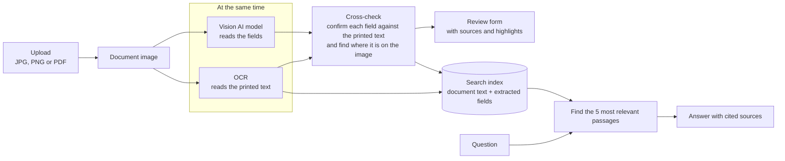
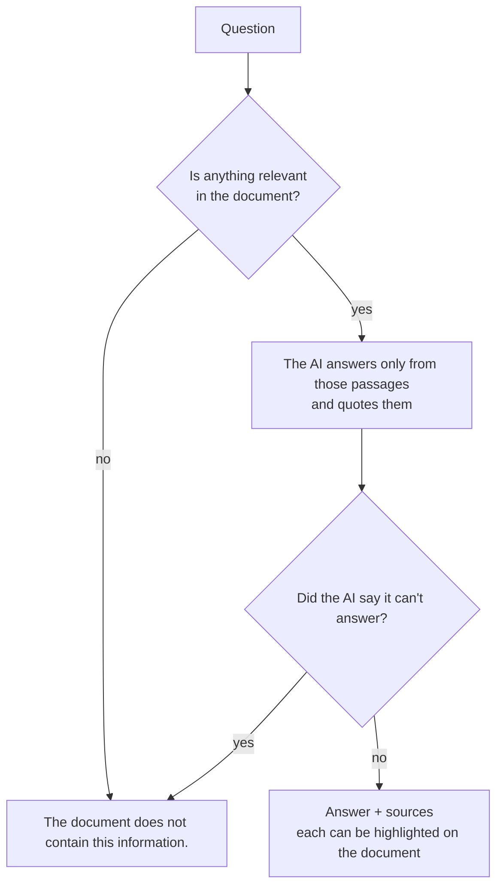

# AI Driving Licence Reader

Upload a photo or PDF of a driving licence and get its details in an editable form, shown side by side with the document. Every value is checked against the text printed on the card. Anything that can't be confirmed is marked **Please verify**, and clicking a field shows where it appears on the licence. A chat answers questions about the licence using only the document, and replies *"The document does not contain this information."* when it can't.

The form has nine fields: Full Name, Driving Licence Number, Date of Birth, Date of Issue, Date of Expiry, Address, Vehicle/Class of Licence, Issuing Authority, and Other relevant information. The last one holds everything else on the card, one item per line.

---

## Technology stack

| Part | Technology |
|---|---|
| Backend | Python 3.11+, FastAPI |
| Reading printed text (OCR) | Tesseract |
| Understanding the licence | A vision AI model through OpenRouter (default `google/gemini-3.8-flash`), or a local model through Ollama |
| PDF support | poppler, via pdf2image |
| Chat search | sentence-transformers embeddings stored in ChromaDB |
| Storage | SQLite, plus files on disk |
| Frontend | React 18, Vite, Tailwind CSS |
| Tests | pytest |
| Packaging | Docker |

---

## Architecture



The chat only answers from the document. Two checkpoints let it refuse instead of guessing:



**How it works**

1. **Upload.** The file's type, content and size (up to 10 MB) are checked, and the file is stored under a random name.
2. **Extract.** OCR and the AI model read the document at the same time. For each value, the AI also returns the exact text it copied from the card, and that text is compared with what OCR read. Fields that match are confirmed; the rest are marked Please verify.
3. **Review.** Edit and save the form. Click a field to see it on the document, or click a highlight to jump to its field.
4. **Chat.** Each answer is built only from text found in the document, and lists them as sources. Questions that need today's date ("how many days until it expires?", "is it still valid?") are answered too: the app works out the numbers from the dates on the card.

| API endpoint | What it does |
|---|---|
| `GET /api/documents` | List uploaded documents |
| `POST /api/documents` | Upload a document |
| `GET /api/documents/{id}/image` | The document image |
| `POST /api/documents/{id}/extract` | Read the document and fill the form |
| `GET /api/documents/{id}/extract` | The saved form, so reopening doesn't re-read the document |
| `PUT /api/documents/{id}/data` | Save your edits |
| `POST /api/documents/{id}/chat` | Ask a question |

---

## Setup/run instructions

You can run the app in either of two ways. Both give you the same complete app, so you only need one. **Docker alone is enough**: the backend, the frontend and all their tools are inside the container.

| | **A. With Docker** (easiest) | **B. Directly on your computer** |
|---|---|---|
| You install | Git and Docker | Git, Python, Node.js, Tesseract and poppler |
| Best for | Using the app | Changing the code and running the tests |

Type the commands in a terminal: **PowerShell** on Windows, **Terminal** on macOS and Linux. After installing a program, close and reopen the terminal so it can find the new command.

### Step 1: Get an OpenRouter API key

The app reaches the AI model through OpenRouter. Create an account at <https://openrouter.ai>, add some credit, and create a key at <https://openrouter.ai/keys>. Keep the key private.

### Step 2: Download the code

Install Git:

- **Windows:** `winget install Git.Git`
- **macOS:** install Homebrew from <https://brew.sh>, then run `brew install git`
- **Ubuntu/Debian:** `sudo apt install git`

Then download the code and go into its folder:

```bash
git clone https://github.com/DeeprajR/dl-reader.git
cd dl-reader
```

Run every command below from this `dl-reader` folder, unless a step says otherwise.

### Step 3: Add your settings

Copy the example settings file to `.env`:

```bash
cp backend/.env.example .env
```

Open `.env` in a text editor (`notepad .env` on Windows, `open -e .env` on macOS, `nano .env` on Linux), paste your key after `OPENROUTER_API_KEY=` and save.

| Setting | Meaning |
|---|---|
| `OPENROUTER_API_KEY` | Your OpenRouter key (required) |
| `LLM_MODEL` | AI model that reads the licence (default `google/gemini-3.8-flash`) |
| `LLM_CHAT_MODEL` | Optional different model for the chat |
| `LLM_MODEL_ALT` | Second model, used only by the comparison script (default `anthropic/claude-sonnet-5`) |
| `MAX_UPLOAD_MB` | Largest file you can upload (default 10) |
| `TESSERACT_CMD`, `POPPLER_PATH` | Where Tesseract and poppler are, if they aren't on your `PATH` (see option B) |

`.env` is never committed, and your key never leaves the server.

### Option A: Run with Docker

1. **Install Docker.**
   - **Windows:** `winget install Docker.DockerDesktop`, then restart your computer if asked.
   - **macOS:** download Docker Desktop from <https://www.docker.com/products/docker-desktop/>.
   - **Linux:** follow <https://docs.docker.com/engine/install/>.

   On Windows and macOS, open Docker Desktop and wait until it shows Docker is running.

2. **Build and start the app.** Run these in the main `dl-reader` folder, where the `Dockerfile` and `.env` are (not in `backend`):

   ```bash
   docker build -t licence-reader .
   docker run -p 7860:7860 --env-file .env licence-reader
   ```

   The first build downloads everything the app needs, so it takes several minutes. Later builds are faster.

3. **Open <http://localhost:7860>.** To stop the app, press **Ctrl+C** in the terminal. To start it again later, run only the `docker run` line.

### Option B: Run directly on your computer

**1. Install Python 3.11+, Node.js 20.19+, Tesseract and poppler.**

**Windows** (PowerShell):

```powershell
winget install Python.Python.3.14
winget install OpenJS.NodeJS.LTS
winget install UB-Mannheim.TesseractOCR
winget install oschwartz10612.Poppler
Set-ExecutionPolicy -Scope CurrentUser RemoteSigned
```

The last line lets PowerShell run `npm` and the Python `activate` script.

These install the **UB Mannheim** build of Tesseract and the **poppler-windows** build of poppler. Neither is added to your `PATH`, so tell the app where they are. Close and reopen PowerShell, then run this to print poppler's folder:

```powershell
(Get-ChildItem "$env:LOCALAPPDATA\Microsoft\WinGet\Packages" -Recurse -Filter pdftoppm.exe).DirectoryName
```

Add both locations to `.env`:

```ini
TESSERACT_CMD=C:\Program Files\Tesseract-OCR\tesseract.exe
POPPLER_PATH=<the folder printed above>
```

If you use conda, `conda install -c conda-forge tesseract poppler` installs both tools instead, and you don't need these two settings.

**macOS** (with Homebrew):

```bash
brew install python node
brew install tesseract poppler
```

**Ubuntu/Debian:**

```bash
sudo apt update
sudo apt install python3-venv
sudo apt install tesseract-ocr poppler-utils
```

Ubuntu's own Node.js is too old, so install the LTS version from <https://nodejs.org/en/download>. Check that `python3 --version` shows 3.11 or newer.

**2. Start the backend** in a terminal:

```bash
cd backend
python3 -m venv .venv                # once. Windows: py -m venv .venv
source .venv/bin/activate            # Windows: .venv\Scripts\activate
pip install -r requirements.txt      # once, takes a few minutes
uvicorn app.main:app --port 8000
```

When it shows `Application startup complete`, the backend is ready. Leave this terminal open.

The `activate` line switches the terminal to the app's own Python and packages. Run it again in every new terminal before using `python`, `pytest` or `uvicorn`.

**3. Start the frontend** in a second terminal:

```bash
cd frontend
npm install                          # once
npm run dev
```

Open <http://localhost:5173>. Both terminals must stay open while you use the app. Press **Ctrl+C** in each one to stop it. The first chat question downloads a small search model (about 90 MB), so it takes a little longer.

Next time, run the same commands but skip the lines marked `once`.

**4. Run the tests** in the `backend` folder, with the virtual environment activated:

```bash
pytest
```

The tests don't call the AI model or the internet, and take about 15 seconds.

### Optional: run the AI model on your own computer (Ollama)

To keep documents entirely on your machine, install Ollama (`winget install Ollama.Ollama` on Windows, or <https://ollama.com/download>), then download a vision model:

```bash
ollama pull qwen2.5vl:3b
```

Then set `LLM_MODEL=ollama/qwen2.5vl:3b` in `.env`.

- **No key needed.** You don't need an OpenRouter key in this setup.
- **Ollama elsewhere.** If Ollama runs somewhere else (for example, if the app runs in Docker), set `OLLAMA_HOST`, e.g. `http://host.docker.internal:11434`.
- **Speed.** Without a GPU, expect 30–60 seconds per licence.

### Optional: compare two AI models

Put some licence images or PDFs in a `samples` folder inside `dl-reader`. This folder is never committed. Then, in the `backend` folder with the virtual environment activated, run:

```bash
python scripts/compare_models.py
```

It reads each licence with both `LLM_MODEL` and `LLM_MODEL_ALT`, and prints their answers side by side.

### Deployment

The Dockerfile builds a single image, about 3 GB, that serves the whole app on port 7860. You can change the port with the `PORT` setting. The first download of the image takes a while; after that the app starts in seconds. The app needs internet access to reach OpenRouter, unless you use Ollama.

---

## AI/LLM approach

### Why an AI model and OCR together

Driving licence layouts vary a lot between states and countries, and the common approaches each fall short:

- **Fixed rules on top of OCR** break as soon as the layout changes.
- **Cloud ID-reading services** support only certain ID types (not, for example, Indian state licences) and tie you to one vendor.
- **A local AI model only** keeps data private, but is slower and less accurate. That's why it's an option here, not the default.
- **An AI model alone** handles any layout, but when it's wrong it's *confidently* wrong.

So the app uses both: the AI model reads the licence, and OCR checks it.

### Two kinds of mistakes

OCR can misread a character, but it never invents anything. An AI model reads well, but can *make things up*: a value that isn't on the card. The app guards against this in four ways:

1. **Copied text.** The AI must copy, word for word, the text it used for each value, and leave a field empty rather than guess.
2. **Cross-check.** That copied text is compared with what OCR read. Only matching fields are confirmed; a made-up value has nothing to match, so it's always marked Please verify.
3. **Date checks.** Dates must make sense (birth before issue, issue before expiry), which catches swapped dates.
4. **Visible sources.** Every field shows the text it came from and where it is on the document, so checking takes a glance.

### Chat

A licence is short enough to hand to the AI model whole, so searching it first isn't strictly necessary. The chat does it anyway because:
- it can refuse questions the document can't answer before asking the AI;
- every answer can point to its exact sources;
- the same design works for longer documents.

### Model choice

Any OpenRouter model that accepts images can be used by changing `LLM_MODEL`. The default was chosen by reading both sample licences with `google/gemini-3.8-flash` and `anthropic/claude-sonnet-5`, using `scripts/compare_models.py`:

| | gemini-3.8-flash | claude-sonnet-5 |
|---|---|---|
| Main fields correct | 16 of 16 | 16 of 16 |
| Values made up | none | 1 (a country not printed on the card) |
| Cost per million tokens (input / output) | $0.75 / $3.75 | $2.00 / $10.00 |

**`google/gemini-3.8-flash` is the default.** It was just as accurate, made nothing up, copied text exactly as printed, and costs about a third as much.

---

## Key technical decisions

### Technology stack

- **Python and FastAPI for the backend.** The app has to wait on two slow things at once (OCR and the AI model), and FastAPI is built for that. It also validates every request and response, and serves the built frontend in the container, so one process runs the whole app. Flask would have needed extra pieces for each of these; Django is far more than a small API needs.
- **Tesseract for OCR.** It runs on your computer for free, and it returns the position of every word, which is what the highlights are built from. Cloud OCR services (Google Vision, AWS Textract) are more accurate but cost money per page and send the licence to another company. EasyOCR and PaddleOCR need a GPU to be usably fast.
- **poppler for PDFs.** Licences often arrive as scanned PDFs. poppler turns the pages into images so the rest of the app only ever handles images. (optional additional)
- **A vision AI model through OpenRouter.** OpenRouter offers models from many vendors through one API, so the model is a setting (`LLM_MODEL`), not code. Using a vendor's own SDK would have tied the app to that vendor.
- **Ollama as a local alternative.** Same setting, different value (`ollama/...`), and the documents never leave the computer. It's optional because local models are slower, resource intensive and less accurate.
- **sentence-transformers and ChromaDB for the chat search.** The search model (`all-MiniLM-L6-v2`) is 90 MB and runs locally, so searching costs nothing and sends nothing anywhere. ChromaDB stores the results in a folder, with no server to run. Hosted alternatives (OpenAI embeddings, Pinecone) would add cost and another place the licence data goes.
- **SQLite and plain files for storage.** A licence reader for one user needs no database server. Everything lives in two folders, which also makes the Docker image self-contained.
- **React, Vite and Tailwind for the frontend.** The interface is a single page with three linked parts (document, form, chat) that update each other, which React handles well. Vite makes changes appear instantly while developing, and Tailwind keeps the styling in the components. Next.js was not needed: there is nothing to render on a server.
- **One Docker image.** Node builds the frontend, then a slim Python image runs the backend with Tesseract, poppler and the search model already inside. One `docker run` starts everything, the same way on every machine.

### AI model

- **The AI model reads, OCR checks.** Fixed rules on top of OCR break when the layout changes. Cloud ID-reading services only support certain ID types. An AI model alone reads any layout but can make things up. Combining the two gives a field that is confirmed only when two independent readers agree. See [AI/LLM approach](#aillm-approach).
- **`google/gemini-3.8-flash` as the default model.** Chosen by reading the sample licences with it and with `anthropic/claude-sonnet-5`: both got every main field right, Gemini made nothing up, and it costs about a third as much. See [Model choice](#model-choice).
- **The model must copy its evidence.** For every value, it returns the exact printed text it used. That text is what gets checked against OCR, and what the highlights point to.
- **Chat answers come only from the document.** Before the AI is asked, the app searches the document; if nothing relevant is found, it refuses. The AI is then given only the matching passages, and every answer lists them as sources.
- **Date arithmetic is done in code, not by the AI.** For questions like "how many days until it expires?", the app calculates days left, age and years held from the form's dates and today's date, and gives the result to the AI as a source marked *Calculated*. AI models make arithmetic slips; code doesn't. The answer still quotes the date printed on the card.

### Design

- **OCR and the AI run at the same time**, so you wait for the slower one, not both.
- **Highlights use OCR's word positions**, because the AI's positions are unreliable and OCR's are exact.
- **Table lines are erased before OCR.** OCR skips rows in tables with ruled lines; erasing the lines fixed this on every test card.
- **Dates are checked for order** (birth before issue, issue before expiry). OCR can confirm a date is printed, but not which label it belongs to.
- **The first two PDF pages form one image**, because two-sided licences are often scanned as two pages.
- **A fixed nine-field form**, so the form looks the same for every licence. Extra details go on their own lines in the last field.
- **Tests use a fake AI model.** The tests check the app's own logic: what it does with a correct answer, a made-up value, a swapped date, a model error or a timeout. A fake model returns those cases on demand; the real one can't be made to, gives slightly different answers each run, and needs a key and internet. The real model is checked separately with `scripts/compare_models.py` and by using the app.

---

## Known limitations

- **Confirmed doesn't mean certain.** "Confirmed" means OCR and the AI agree. If both misread the same text, it won't be caught, so always review the form.
- **Some fields can't be highlighted.** Highlights depend on OCR: unusual fonts, busy backgrounds or dotted table lines can stop a field from being found. It then shows its source text without a highlight.
- **Personal data (PII).** With the default setup, images and chat questions are sent through OpenRouter to the AI provider. OpenRouter's zero-data-retention setting is enabled on the account. For fully local processing, use Ollama; OCR and chat search always run locally.
- **Two-sided licences.** Both sides in one image, or a two-page PDF, work. Front and back uploaded as two separate files are treated as two documents, and PDF pages after the second are ignored.
- **No chat memory.** The chat answers each question on its own, without remembering earlier ones.
- **Reading time.** Reading a licence takes about 8–15 seconds with the default model.
- **No login.** Anyone who can open the app can see all uploads, so run it locally.
- **No long-term storage with Docker.** Documents are kept inside the container, so each `docker run` starts with an empty list. When run directly on your computer, they stay in `backend/data` and `backend/chroma`.

---

## AI development tools used

- **Claude Code** using **Claude Opus 5**. It was used to write the code, tests and Dockerfile, run the model comparison, and check each step in a browser.
