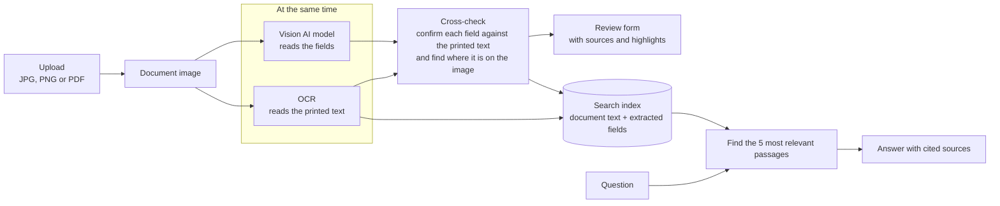
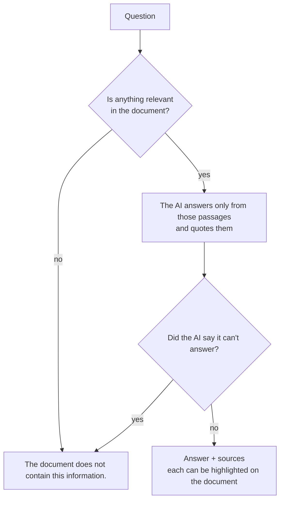

# AI Driving Licence Reader

Upload a photo or PDF of a driving licence and get its details in an editable form, shown side by side with the document. Every value is checked against the text printed on the card. Anything that can't be confirmed is marked **Please verify**, and clicking a field shows where it appears on the licence. A chat answers questions about the licence using only the document, and replies *"The document does not contain this information."* when it can't.

The form has nine fields: Full Name, Driving Licence Number, Date of Birth, Date of Issue, Date of Expiry, Address, Vehicle/Class of Licence, Issuing Authority, and Other relevant information. The last one holds everything else on the card, one item per line.

---

## Technology stack

| Part | Technology |
|---|---|
| Backend | Python 3.11+, FastAPI |
| Reading printed text (OCR) | Tesseract |
| Understanding the licence | A vision AI model through OpenRouter (default `google/gemini-3.8-flash`), or a local model through Ollama |
| PDF support | poppler, via pdf2image |
| Chat search | sentence-transformers embeddings stored in ChromaDB |
| Storage | SQLite, plus files on disk |
| Frontend | React 18, Vite, Tailwind CSS |
| Tests | pytest |
| Packaging | Docker |

---

## Architecture



The chat only answers from the document. Two checkpoints let it refuse instead of guessing:



**How it works**

1. **Upload.** The file's type, content and size (up to 10 MB) are checked, and the file is stored under a random name. For a PDF, the first two pages (front and back) are used.
2. **Extract.** OCR and the AI model read the document at the same time. For each value, the AI also returns the exact text it copied from the card, and that text is compared with what OCR read. Fields that match are confirmed; the rest are marked Please verify.
3. **Review.** Edit and save the form. Click a field to see it on the document, or click a highlight to jump to its field.
4. **Chat.** Each answer is built only from passages found in the document, and lists them as sources.

| API endpoint | What it does |
|---|---|
| `GET /api/documents` | List uploaded documents |
| `POST /api/documents` | Upload a document |
| `GET /api/documents/{id}/image` | The document image |
| `POST /api/documents/{id}/extract` | Read the document and fill the form |
| `GET /api/documents/{id}/extract` | The saved form, so reopening doesn't re-read the document |
| `PUT /api/documents/{id}/data` | Save your edits |
| `POST /api/documents/{id}/chat` | Ask a question |

---

## Setup/run instructions

You need **Python 3.11+**, **Node.js 20.19+** and an **OpenRouter API key** (<https://openrouter.ai/keys>).

### 1. Install Tesseract and poppler

- **macOS:** `brew install tesseract poppler`
- **Ubuntu/Debian:** `sudo apt install tesseract-ocr poppler-utils`
- **Windows:** either install the **UB Mannheim** build of Tesseract (<https://github.com/UB-Mannheim/tesseract/wiki>) and a **poppler-windows** release (<https://github.com/oschwartz10612/poppler-windows/releases>), or run `conda install -c conda-forge tesseract poppler`.

If the tools aren't on your `PATH` (common on Windows), add their locations to `.env` in step 2:

```ini
TESSERACT_CMD=C:\Program Files\Tesseract-OCR\tesseract.exe
POPPLER_PATH=C:\path\to\poppler\Library\bin
```

### 2. Add your settings

In the project folder, copy the example settings file, then paste your key after `OPENROUTER_API_KEY=`:

```bash
cp backend/.env.example .env        # Windows: copy backend\.env.example .env
```

| Setting | Meaning |
|---|---|
| `OPENROUTER_API_KEY` | Your OpenRouter key (required) |
| `LLM_MODEL` | AI model that reads the licence (default `google/gemini-3.8-flash`) |
| `LLM_CHAT_MODEL` | Optional different model for the chat |
| `LLM_MODEL_ALT` | Second model, used only by the comparison script (default `anthropic/claude-sonnet-5`) |
| `MAX_UPLOAD_MB` | Largest file you can upload (default 10) |
| `TESSERACT_CMD`, `POPPLER_PATH` | Only needed if the tools aren't on your `PATH` |

`.env` is never committed, and your key never leaves the server.

### 3. Start the backend (first terminal)

```bash
cd backend
python -m venv .venv                 # once: create a virtual environment
source .venv/bin/activate            # Windows: .venv\Scripts\activate
pip install -r requirements.txt      # once: install the packages
uvicorn app.main:app --port 8000
```

In every new terminal, run the `activate` line again before using `python`, `pytest` or `uvicorn`. Otherwise your system Python won't find the packages.

### 4. Start the frontend (second terminal)

```bash
cd frontend
npm install                          # once
npm run dev
```

Open <http://localhost:5173>.

### 5. Run the tests

In the `backend` folder, with the virtual environment activated:

```bash
pytest
```

The tests don't call the AI model or the internet, and take about 15 seconds.

### 6. Or run everything with Docker

```bash
docker build -t licence-reader . && docker run -p 7860:7860 --env-file .env licence-reader
```

Open <http://localhost:7860>.

### Optional: run the AI model on your own computer (Ollama)

To keep documents entirely on your machine, install [Ollama](https://ollama.com), download a vision model, and set `LLM_MODEL=ollama/qwen2.5vl:3b` in `.env`:

```bash
ollama pull qwen2.5vl:3b
```

- **No key needed.** You don't need an OpenRouter key in this setup.
- **Ollama elsewhere.** If Ollama runs somewhere else (for example, if the app runs in Docker), set `OLLAMA_HOST`, e.g. `http://host.docker.internal:11434`.
- **Speed.** Without a GPU, expect 30–60 seconds per licence.

### Optional: compare two AI models

In the `backend` folder, with the virtual environment activated:

```bash
python scripts/compare_models.py
```

It reads the licences in the `samples/` folder with both `LLM_MODEL` and `LLM_MODEL_ALT`, and prints their answers side by side.

### Deployment

The Dockerfile builds a single image, about 3 GB, that serves the whole app on port 7860. You can change the port with the `PORT` setting. The first download of the image takes a while; after that the app starts in seconds. The app needs internet access to reach OpenRouter, unless you use Ollama.

---

## AI/LLM approach

### Why an AI model and OCR together

Driving licence layouts vary a lot between states and countries, and the common approaches each fall short:

- **Fixed rules on top of OCR** break as soon as the layout changes.
- **Cloud ID-reading services** support only certain ID types (not, for example, Indian state licences) and tie you to one vendor.
- **A local AI model only** keeps data private, but is slower and less accurate. That's why it's an option here, not the default.
- **An AI model alone** handles any layout, but when it's wrong it's *confidently* wrong.

So the app uses both: the AI model reads the licence, and OCR checks it.

### Two kinds of mistakes

OCR can misread a character, but it never invents anything. An AI model reads well, but can *make things up*: a value that isn't on the card. The app guards against this in four ways:

1. **Copied text.** The AI must copy, word for word, the text it used for each value, and leave a field empty rather than guess.
2. **Cross-check.** That copied text is compared with what OCR read. Only matching fields are confirmed; a made-up value has nothing to match, so it's always marked Please verify.
3. **Date checks.** Dates must make sense (birth before issue, issue before expiry), which catches swapped dates.
4. **Visible sources.** Every field shows the text it came from and where it is on the document, so checking takes a glance.

### Chat

A licence is short enough to hand to the AI model whole, so searching it first isn't strictly necessary. The chat does it anyway because:
- it can refuse questions the document can't answer before asking the AI;
- every answer can point to its exact sources;
- the same design works for longer documents.

### Model choice

Any OpenRouter model that accepts images can be used by changing `LLM_MODEL`. The default was chosen by reading both sample licences with `google/gemini-3.8-flash` and `anthropic/claude-sonnet-5`, using `scripts/compare_models.py`:

| | gemini-3.8-flash | claude-sonnet-5 |
|---|---|---|
| Main fields correct | 16 of 16 | 16 of 16 |
| Values made up | none | 1 (a country not printed on the card) |
| Cost per million tokens (input / output) | $0.75 / $3.75 | $2.00 / $10.00 |

**`google/gemini-3.8-flash` is the default.** It was just as accurate, made nothing up, copied text exactly as printed, and costs about a third as much.

---

## Key technical decisions

| Decision | Alternatives considered | Why |
|---|---|---|
| AI model checked by OCR | OCR with fixed rules; cloud ID services; AI model alone | Works on any layout, and a field is confirmed only when two independent readers agree |
| OCR and the AI run at the same time | One after the other | Faster: you wait for the slower of the two, not both |
| Highlights use OCR's word positions | Asking the AI where things are | The AI's positions are unreliable; OCR's are exact |
| Table lines are erased before OCR | Other OCR settings | OCR skips rows in tables with ruled lines; erasing the lines fixed this on every test card |
| Dates are checked for order | Trusting the AI to match each label to the right date | OCR can confirm a date is printed, but not which label it belongs to |
| Any model through OpenRouter, chosen in `.env` | A separate integration for each AI vendor | Switch models without changing code; Ollama for a local model |
| The first two PDF pages form one image | First page only | Two-sided licences are often scanned as two pages |
| A fixed nine-field form | One box per detail found | The form stays the same for every licence; extra details go on their own lines |
| SQLite and files on disk | A separate database server | Nothing extra to install or run |
| One Docker container for everything | Separate frontend and backend hosting | One command to run, the same everywhere |
| Tests use a fake AI model | Testing against the real model | Fast, free and repeatable, with no internet needed |

---

## Known limitations

- **Confirmed doesn't mean certain.** "Confirmed" means OCR and the AI agree. If both misread the same text, it won't be caught, so always review the form.
- **Some fields can't be highlighted.** Highlights depend on OCR: unusual fonts, busy backgrounds or dotted table lines can stop a field from being found. It then shows its source text without a highlight.
- **Personal data (PII).** With the default setup, images and chat questions are sent through OpenRouter to the AI provider. OpenRouter's zero-data-retention setting is enabled on the account. For fully local processing, use Ollama; OCR and chat search always run locally.
- **Two-sided licences.** Both sides in one image, or a two-page PDF, work. Front and back uploaded as two separate files are treated as two documents, and PDF pages after the second are ignored.
- **No chat memory.** The chat answers each question on its own, without remembering earlier ones.
- **Reading time.** Reading a licence takes about 8–15 seconds with the default model.
- **No login.** Anyone who can open the app can see all uploads, so run it locally.
- **No long-term storage.** Data stays in the app's local folders (`data/` and `chroma/`). A Docker container loses it when the container is removed.

---

## AI development tools used

- **Claude Code** with **Claude Opus 5**. It was used to write the code, tests and Dockerfile, run the model comparison, and check each step in a browser.
