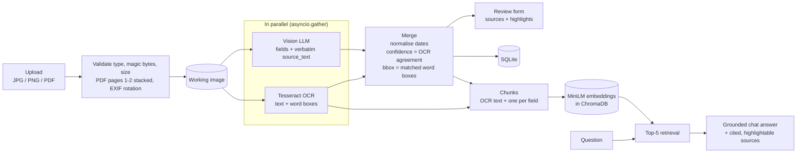
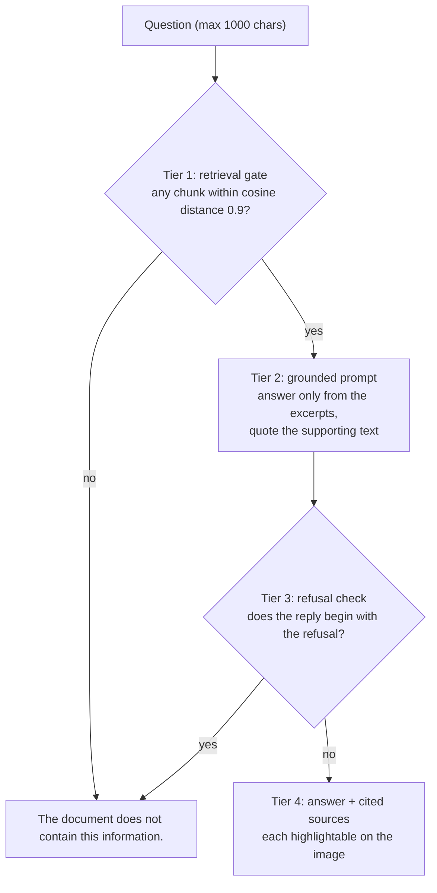

# AI Driving Licence Reader

Upload a driving licence as a JPG, PNG or PDF, and the app turns it into an editable form shown next to the document. A vision LLM reads the licence while Tesseract OCR reads the same image independently. Every value is cross-checked against the printed text, anything that can't be confirmed is flagged for review, and clicking a field highlights where it is printed. An **Ask the Document** chat answers questions from the licence alone, cites its sources, and replies *"The document does not contain this information."* rather than guess.

The form has nine fields: **Full Name, Driving Licence Number, Date of Birth, Date of Issue, Date of Expiry, Address, Vehicle/Class of Licence, Issuing Authority** and **Other relevant information**. The last one lists everything else found on the card, one `Label: value` line per item, for example `Blood group: O+` or `LMV · Valid till: 2034-06-15`.

---

## Technology stack

| Layer | Choice |
|---|---|
| Backend | Python 3.11+, FastAPI, uvicorn, pydantic v2 |
| OCR | Tesseract via `pytesseract` (`image_to_data` for word boxes); NumPy to erase table rulings before OCR |
| PDF | `pdf2image` + poppler: pages 1–2 (front and back) rendered to one image |
| LLM | OpenRouter's OpenAI-compatible API through the `openai` SDK. Model set by `LLM_MODEL` (default `google/gemini-3.8-flash`); an optional local model via Ollama |
| Chat retrieval | `sentence-transformers` `all-MiniLM-L6-v2` embeddings in ChromaDB (in-process, persisted to `./chroma`) |
| Storage | SQLite, plus uploaded files under `./data/uploads` with server-generated UUID names |
| Frontend | React 18 + Vite, plain `fetch`, Tailwind CSS |
| Tests | pytest + FastAPI `TestClient`, with no real LLM or network calls |
| Container | One multi-stage Dockerfile: a Node build stage, then `python:3.11-slim` with `tesseract-ocr` and `poppler-utils` |

---

## Architecture



The chat is grounded in four tiers, and each tier can end a request with the exact refusal:



**How a document flows through the app:**

1. **Upload.** The file is validated by extension, magic bytes and size (at most 10 MB), and stored under a UUID name. Phone-photo rotation is applied to the pixels, and a PDF's first two pages are stacked into one working image.
2. **Extract.** Tesseract (in a thread executor) and the vision LLM run at the same time. The LLM returns every field with the exact text it read (`source_text`). The merge step then:
   - normalises dates to YYYY-MM-DD;
   - marks each field `high` or `review` by comparing it with the OCR text;
   - matches each field to OCR word boxes for its highlight.
   The result is saved, so reopening a document never re-runs extraction.
3. **Review.** The form shows each field with its source and a clickable highlight, both ways: click a field to see it on the image, or a highlight to jump to its field. Saving an edit updates the chat's index too.
4. **Chat.** The OCR text and the extracted fields are indexed as ~200-character chunks. A question retrieves the top 5, and the answer is grounded in them.

| Endpoint | Purpose |
|---|---|
| `GET /api/documents` | List uploads |
| `POST /api/documents` | Upload a file → `201 {doc_id}`; invalid → `400 {"error": ...}` |
| `GET /api/documents/{id}/image` · `/meta` | The working image · its pixel size |
| `POST /api/documents/{id}/extract` | Run OCR and the LLM, merge, save → `ExtractionResult` |
| `GET /api/documents/{id}/extract` | The saved result (404 if never extracted) |
| `PUT /api/documents/{id}/data` | Save edited fields (validated) |
| `POST /api/documents/{id}/chat` | `{question}` → `{answer, sources: [{text, origin, bbox}]}` |

Every error comes back as JSON `{"error": "..."}` with a readable message, never a stack trace.

```
backend/app/main.py                  app setup, startup checks, JSON errors, serves the built frontend
backend/app/routes/                  documents.py (upload, extract, save), chat.py
backend/app/services/ocr.py          Tesseract wrapper (text + word boxes, table rulings erased)
backend/app/services/extraction.py   dates, confidence, highlight matching, date-order checks
backend/app/services/providers/      provider Protocol + factory; OpenRouter and Ollama providers
backend/app/services/rag.py          chunk, embed, retrieve, answer
backend/app/services/storage.py      SQLite + file storage
backend/scripts/compare_models.py    side-by-side model comparison
backend/tests/                       pytest suite, marked by build phase and step
frontend/src/                        React app: document list, upload, workspace (form + chat)
```

---

## Setup/run instructions

You need **Python 3.11+**, **Node.js 20.19+**, **Tesseract**, **poppler** and an **OpenRouter API key**. After the one-time setup, running the app takes two commands, or a single `docker run`.

### 1. Install Tesseract and poppler

**macOS**

```bash
brew install tesseract poppler
```

**Ubuntu / Debian**

```bash
sudo apt install tesseract-ocr poppler-utils
```

**Windows**: either of these:

- Install the **UB Mannheim** Tesseract build (<https://github.com/UB-Mannheim/tesseract/wiki>) and a **poppler-windows** release (<https://github.com/oschwartz10612/poppler-windows/releases>).
- Or use conda: `conda install -c conda-forge tesseract poppler`.

The Windows installers usually don't add the tools to `PATH`. In that case, point to them in `.env` (next step):

```ini
TESSERACT_CMD=C:\Program Files\Tesseract-OCR\tesseract.exe
POPPLER_PATH=C:\path\to\poppler\Library\bin
```

Both settings are optional; left empty, the tools are looked up on `PATH`. If a configured path doesn't exist, the app logs a warning and falls back to `PATH`, so the same `.env` also works inside Docker.

### 2. Create `.env` with your OpenRouter key

Copy the template to the **repository root** and add a key from <https://openrouter.ai/keys>:

```bash
cp backend/.env.example .env        # Windows: copy backend\.env.example .env
```

```ini
OPENROUTER_API_KEY=sk-or-...               # required: the server won't start without it (unless both models run on Ollama)
LLM_MODEL=google/gemini-3.8-flash          # extraction model; also used for chat unless LLM_CHAT_MODEL is set
LLM_MODEL_ALT=anthropic/claude-sonnet-5    # used only by scripts/compare_models.py
LLM_CHAT_MODEL=                            # optional separate chat model
MAX_UPLOAD_MB=10
TESSERACT_CMD=
POPPLER_PATH=
```

`.env` is git-ignored. The key stays on the server: it is never sent to the browser and never logged.

### 3. Run the backend

```bash
cd backend
python -m venv .venv
source .venv/bin/activate            # Windows: .venv\Scripts\activate
pip install -r requirements.txt
uvicorn app.main:app --reload --port 8000
```

On first start, the embedding model (~90 MB) downloads once, in the background.

### 4. Run the frontend

```bash
cd frontend
npm install
npm run dev                          # http://localhost:5173 (proxies /api to the backend on :8000)
```

Open <http://localhost:5173>.

### 5. Run the tests

```bash
cd backend
pytest                  # whole suite, about 15 s
pytest -m phase1        # the core app (build steps 1-5)
pytest -m step4         # a single build step (step1 ... step10)
```

The suite makes no real LLM or network calls:
- **Extraction** uses a fake provider injected through the provider factory.
- **Embeddings** are deterministic fakes.
- **ChromaDB** runs in memory.
- **OCR tests** use the real Tesseract binary, and are skipped if it isn't installed.

### 6. Run with Docker

```bash
docker build -t licence-reader . && docker run -p 7860:7860 --env-file .env licence-reader
```

Open <http://localhost:7860>. One container serves both the API and the built frontend.

### Optional: a fully local model with Ollama (no personal data leaves the machine)

```bash
ollama pull qwen2.5vl:3b
```

Then set `LLM_MODEL=ollama/qwen2.5vl:3b` in `.env`.
- **Everything stays local.** Extraction and chat both run on the local model, so no image, OCR text or chat excerpt leaves the machine, and no OpenRouter key is needed.
- **Server address.** The app finds Ollama through Ollama's own `OLLAMA_HOST` setting (default `http://127.0.0.1:11434`). From inside Docker, use `OLLAMA_HOST=http://host.docker.internal:11434`.
- **Speed.** A vision model on CPU typically takes 30–60 s per licence, and the first request also loads the model. Ollama calls therefore get a 300 s timeout.

### Optional: compare two models

```bash
cd backend
python scripts/compare_models.py     # every file in ./samples, through LLM_MODEL and LLM_MODEL_ALT
```

It prints a field-by-field table per document (`field | model A | model B | agree?`), each model's count of empty fields, and total latency. It has no pass/fail logic; the output is for a person to judge.

### Deployment

- **Dockerfile.** The multi-stage Dockerfile produces one image that serves everything, running as a non-root user. It listens on port **7860**; change it with the `PORT` environment variable.
- **Cold starts:** the image is about 3 GB (CPU PyTorch, ChromaDB and the baked-in embedding model), so the first pull takes a while. After that the server starts in seconds.
- **Network:** the container needs outbound HTTPS to `openrouter.ai`, unless it uses a local Ollama model.

---

## AI/LLM approach

### Why a vision LLM *and* OCR

Each of the usual approaches fails in its own way:

- **OCR with rules or regex** breaks across layouts. Labels move, values wrap and tables differ from state to state, and OCR alone can't tell which number is the licence number.
- **Cloud ID processors** (AWS Textract AnalyzeID, Google Document AI) handle the ID types they support, but coverage outside those (for example, Indian state licences) is limited. They also tie the design to one vendor, and still send the image to a third party.
- **A self-hosted model only** keeps all data local, but on typical hardware it is slower and reads less reliably. So it is offered as an option (Ollama), not forced as the default.
- **A vision LLM alone** copes with any layout, but when it's wrong it is *confidently* wrong: a plausible licence number that isn't on the card.

### Hallucination versus recognition errors

The two engines fail differently. **OCR** makes *recognition* errors: a misread character, or a table cell it didn't read at all. These are visible and local, and OCR never invents a field. **A vision LLM** reads difficult print well, but can *hallucinate*: fill a gap, infer a value that isn't printed, or reword what is. The app uses each to check the other:

1. **Evidence first.** The prompt asks for `source_text`, exactly what is printed, next to every value, and tells the model to return null rather than guess: *"A wrong licence number is worse than a null."*
2. **Independent cross-check.** Each field's `source_text` is compared with Tesseract's text, by exact match, a difflib sliding window (ratio ≥ 0.85), or digits only for dates. A field that matches is `high`; anything else is flagged "Please verify". An invented value has nothing printed to match, so it can't come out `high`.
3. **Which date is which.** The model maps labels such as "DOI" or "Valid Till" to fields by meaning, and the prompt names the common labels for each date. The printed label is kept in the source (`Source: DOI: 16-06-2019`), so a reviewer can see where each date came from. A mix-up would still pass the OCR check, because both dates are printed. So a separate check flags impossible orders: birth before issue before expiry, for the licence and for each vehicle class, and no issue or birth date in the future.
4. **Grounding the reviewer can see.** Every field shows its source text, and most can be highlighted on the image, so checking a field takes a glance.
5. **Fail-safe defaults.** Empty fields are always "Please verify". If OCR finds fewer than 20 characters, every field is flagged, because the cross-check can't be trusted.

### Grounded chat with retrieval

A licence is a few hundred characters, so retrieval is technically overkill: the whole card would fit in the prompt. It's implemented anyway:
- **It's a real RAG pipeline:** chunk, embed, retrieve, answer from excerpts, cite sources.
- **It powers the first grounding tier:** a question with no relevant chunk is refused before any LLM call.
- **Every cited excerpt has provenance:** where it came from (OCR text or an extracted field), plus a box on the image.
- **It scales unchanged to multi-page documents.**

The index holds OCR text in ~200-character chunks of whole lines with a one-line overlap, one chunk per extracted field (e.g. `Field: licence_number = MH12 20190001234 (source: 'MH12 20190001234')`), and one summary of every vehicle class's dates. The summary lets a question about *all* classes be answered despite top-5 retrieval.

### Model choice

The app works with any model: `LLM_MODEL` accepts any OpenRouter model that takes image input, with no code changes. The default was chosen by running both sample licences through **`google/gemini-3.8-flash`** and **`anthropic/claude-sonnet-5`** with `scripts/compare_models.py`:

| | gemini-3.8-flash | claude-sonnet-5 |
|---|---|---|
| Core fields correct (8 per card × 2) | **16 / 16** | **16 / 16** |
| Values not printed on the card | **none** | 1 (`country: India`, with no source text) |
| Values copied verbatim from the card | yes | sometimes reworded (`state: Delhi` from "GOVERNMENT OF … DELHI") |
| Latency, two cards | 28.5 s | 22.5 s |
| Price per 1M tokens (input / output) | **$0.75 / $3.75** | $2.00 / $10.00 |

**`google/gemini-3.8-flash` is the default.** Accuracy on the core fields was identical, and every disagreement was in optional extra fields. Gemini invented nothing and copied values exactly as printed, which the OCR cross-check and highlighting depend on. It also costs about 2.7× less, at similar speed (8–15 s per card).

---

## Key technical decisions

| Decision | Alternatives considered | Rationale |
|---|---|---|
| Vision LLM cross-checked by local Tesseract OCR | OCR + rules; cloud ID processors; LLM alone | Handles any layout, and confidence comes from two independent readers agreeing, not from the model grading itself |
| OCR and LLM run in parallel | One after the other | Wait time is the slower of the two, not their sum; OCR (~1–2 s) is hidden behind the LLM call |
| Confidence = agreement with OCR text | The LLM's own confidence score | Models' self-reported confidence is poorly calibrated; agreement with OCR can be checked and explained |
| Highlights from OCR word boxes matched to `source_text` | Asking the LLM for coordinates | LLM coordinates are unreliable; OCR boxes are exact pixels, and a miss just means no highlight |
| Date-order check on top of the OCR check | Trusting the model's label mapping | The OCR check proves a date is printed, not which label it belongs to; a swap would otherwise go unnoticed |
| Table rulings erased before OCR | Other Tesseract layout modes; OpenCV | Tesseract drops whole rows of ruled tables, and no layout mode fixed that on every card. Erasing thin straight lines recovered every row, including a cell nothing else could read, while keeping solid title banners |
| Per-class dates located by their exact class label, rows found by position | Fuzzy or first-word matching | Similar codes (LMV / LMV TR, MCWG / MCWOG) and repeated dates would otherwise land on the wrong row; if in doubt there's no highlight, never a wrong one |
| OpenRouter through the `openai` SDK, model from `.env` | One SDK per vendor | One integration, any model swappable by a setting, and a fair side-by-side comparison |
| Provider interface + factory; `ollama/…` runs locally | One hard-wired provider | The fully local option is one setting away; prompt, parsing and retry logic are shared |
| JSON-only prompt, parse, one retry | Strict JSON-schema mode | Schema-mode support varies between providers behind OpenRouter; the parser also accepts code fences and loose shapes |
| 60 s timeout and one retry (timeouts, rate limits, server errors, bad JSON) | SDK automatic retries | Predictable behaviour; key, credit and model errors fail fast with a clear message |
| PDFs: pages 1–2 stacked into one image | First page only; a multi-page viewer | Two-sided licences are often scanned as two pages; one image keeps OCR, highlights and the viewer unchanged |
| Nine-field form; extras as editable `Label: value` lines | One input per extracted item | A fixed, predictable form, while each item keeps its own source, confidence and highlight behind the scenes |
| Four-tier grounded chat with exact refusal | Prompt only | The refusal must be exactly the required sentence, and irrelevant excerpts never reach the model |
| SQLite + files on disk, UUID names, magic-byte checks | External database; object storage | No infrastructure to run; client filenames are never used as paths |
| One container serving API and frontend | Separate frontend hosting + CORS | One port and origin; the relative `/api` path works everywhere |
| CPU-only PyTorch, embedding model baked in, non-root user | Default PyTorch wheels; downloading at runtime | Avoids ~2 GB of GPU libraries, works offline, and the container doesn't run as root |
| Tests with a fake provider, fake embeddings and in-memory Chroma | Tests against a live model | Fast (~15 s), repeatable and offline; each build step can be checked on its own |

---

## Known limitations

- **Confidence means agreement, not truth.** If the LLM and OCR both misread a value the same way, it is marked `high`. Human review of the form is still part of the workflow.
- **Highlights depend on OCR.** Stylised fonts, busy backgrounds, dotted table lines or text touching the lines can stop a field from being located. The field then shows its source text without a highlight, and never a wrong one. Very short codes (1–2 characters, like `A` or `C1`) in a list can't be confirmed on their own, so such values stay "Please verify".
- **Personal data and third parties (PII).** By default, images and chat excerpts go through OpenRouter to the underlying model provider. This is mitigated by OpenRouter's zero-data-retention / no-training setting, which is enabled on the account. The Ollama option keeps everything on the machine. OCR, embeddings and retrieval always run locally.
- **Two-sided licences.** Both sides in one image (side by side or stacked) work, as do the first two pages of a PDF. Front and back uploaded as two separate files become two separate documents, and PDF pages after the second are ignored. A composite image gives each side fewer pixels, so low-resolution scans read less reliably.
- **Chat.** Retrieval returns the top 5 excerpts, and each question is answered on its own, with no conversation memory. Small local models tend to over-refuse (safe, but less helpful).
- **Speed.** An extraction takes 8–15 s with the default model. With Ollama on modest hardware, the first request after the model loads can take minutes.
- **No authentication or multiple users.** Anyone who can reach the server can see every upload. Run it locally or behind your own access control.
- **Data is session-scoped by design.** Uploads, results and the chat index live in `./data` and `./chroma` in the running instance. A container without a volume loses them when it's removed.

---

## AI development tools used

- **Claude Code** (Anthropic's agentic coding tool, in VS Code) with **Claude Opus 5**. It was used to implement the backend, frontend, tests and Dockerfile, to run the model comparison, and to verify each build step in a real browser with Playwright scripts.
